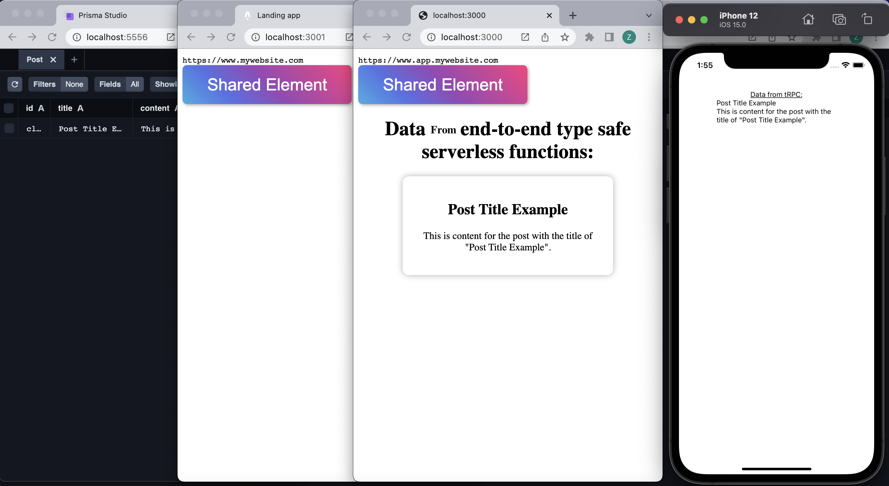

# Hopem Example

This is an example repo related to the ideas I presented on September 29th 2022.

## Apps and Packages

- `landing-web`: a [Astro](https://astro.build) app
- `web-app`: a [Next.js](https://nextjs.org) app
- `mobile-app`: an [Expo](https://docs.expo.dev/) React Native app
- `db`: the database schema (using [prisma](https://www.prisma.io)) with temporary db.sqlite
- `ui-web`: a stub React component library shared by both `web-app` and `landing-web` applications
- `config`: `eslint` configurations (includes `eslint-config-next` and `eslint-config-prettier`) and `tsconfig.json`s used throughout the monorepo

Each package/app is 100% [TypeScript](https://www.typescriptlang.org/).



**To run the mobile apps, it is assumed that you have already ran react-native apps on your machine**

## Initialize

Install the dependencies for all apps and packages, run the following command from the root folder:

```
yarn
```

## Build

To build all apps and packages, run the following command from the root folder:

```
yarn build
```

## Develop all apps and packages with iOS mobile app

Run the following command from the root folder:

```
yarn dev
```

## Develop all apps and packages with Android mobile app

In the `./mobile-apps/package.json`, Replace the line `6` with the following:

```diff
-      "dev": "expo start --ios",
+      "dev": "expo start --android",
```

Then, run the following command from the root folder:

```
yarn dev
```

## Develop an individual app with the packages in its dependencies

Run the following command from the root folder with the apps initials instead of `<initials>`:

```
yarn dev:<initials>
```

Landing-web example:

```
yarn dev:lw
```

### Remote Caching

Turborepo can use a technique known as [Remote Caching](https://turborepo.org/docs/core-concepts/remote-caching) to share cache artifacts across machines, enabling you to share build caches with your team and CI/CD pipelines.

By default, Turborepo will cache locally. To enable Remote Caching you will need an account with Vercel. If you don't have an account you can [create one](https://vercel.com/signup), then enter the following commands:

```
cd my-turborepo
npx turbo login
```

This will authenticate the Turborepo CLI with your [Vercel account](https://vercel.com/docs/concepts/personal-accounts/overview).

Next, you can link your Turborepo to your Remote Cache by running the following command from the root of your turborepo:

```
npx turbo link
```

### Useful Turborepo Links

Learn more about the power of Turborepo:

- [Pipelines](https://turborepo.org/docs/core-concepts/pipelines)
- [Caching](https://turborepo.org/docs/core-concepts/caching)
- [Remote Caching](https://turborepo.org/docs/core-concepts/remote-caching)
- [Scoped Tasks](https://turborepo.org/docs/core-concepts/scopes)
- [Configuration Options](https://turborepo.org/docs/reference/configuration)
- [CLI Usage](https://turborepo.org/docs/reference/command-line-reference)
